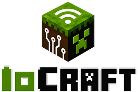
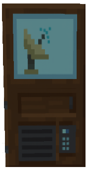
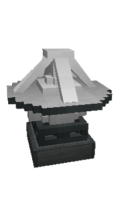
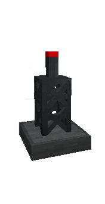

<p align="center">
  
</p>


**IoCraft** is a Minecraft Forge mod that connects the game to local IoT devices and external software (dashboards, automation tools, bots) through WebSocket, with a security-first LAN approach.

> Control Minecraft from the outside world on your local network, without depending on the internet by default.

**Quick links:** [Installation](#instalación) · [Commands](#comandos) · [Authentication](#sistema-de-autenticación) · [API](#api-de-comunicación) · [AI Integration](#integración-con-ia) · [Security Policy](#política-de-seguridad)

---

## Tabla de Contenidos

1. [Alcance oficial del proyecto](#alcance-oficial-del-proyecto)
2. [Instalación](#instalación)
3. [Comandos](#comandos)
4. [Sistema de Autenticación](#sistema-de-autenticación)
5. [Bloques](#bloques)
6. [Conexión de Dispositivos](#conexión-de-dispositivos)
7. [API de Comunicación](#api-de-comunicación)
8. [Integración con IA](#integración-con-ia)
9. [Baseline de compatibilidad (Fase 0)](#baseline-de-compatibilidad-fase-0)
10. [Créditos del mod](#créditos-del-mod)
11. [Política de seguridad](#política-de-seguridad)
12. [Política de responsabilidad de uso](#política-de-responsabilidad-de-uso)

---

## Alcance oficial del proyecto

### Resumen

IoCraft es un mod enfocado en **IoT local para Minecraft** y en una **extensibilidad orientada a IoT** mediante addons compatibles.

### Detalle técnico

Objetivos del proyecto:

- Integrar dispositivos IoT por WebSocket en entornos LAN/local.
- Mantener seguridad operativa (auth, anti-replay, blacklist, rotación/revocación).
- Exponer una API estable y versionada para que otros mods amplíen funcionalidades IoT.
- Proveer observabilidad y control operativo para addons (métricas, políticas por owner).

No objetivos del proyecto:

- Ser una plataforma generalista de plugins para cualquier caso no-IoT.
- Exponer directamente servicios a Internet desde el core del mod.
- Implementar sandbox completo del proceso JVM de Minecraft.

### Compatibilidad

- Toda evolución del core y de la API de addons sigue regla **aditiva** mientras se mantenga la misma major.
- Las extensiones deben consumir `IoCraftApiProvider` y validar versión de API en runtime.
- El core conserva prioridad de estabilidad sobre addons externos.

### Cómo verificar

- Para evaluar una nueva propuesta/cambio, usar este criterio:
  - ¿Mejora IoT local o extensibilidad IoT?
  - ¿Evita romper baseline existente?
  - ¿Respeta seguridad y operación LAN por defecto?
  - Si la respuesta es “no” en alguno, queda fuera de alcance del core.

---

## Instalación

1. Descarga el archivo JAR del mod
2. Colócalo en la carpeta `mods` de tu instancia de Minecraft con Forge 1.18.2
3. Ejecuta el juego

El servidor WebSocket se inicia automáticamente al cargar el servidor de Minecraft.

---
Para regenerar las carpetas, ejecuta:
# Generar archivos de IDEA (.idea)
./gradlew idea
# Generar configuraciones de ejecución
./gradlew genIntellijRuns
# Compilar el mod (genera carpeta build/)
./gradlew build
Esto regenerará:
- .idea/ - configuración de IntelliJ
- build/ - archivos compilados
- run/ - se genera al ejecutar el juego con runClient o runServer
---

## Comandos

| Comando | Descripción |
|---------|-------------|
| `/ioc info` | Muestra IP y puerto para conectar dispositivos |
| `/ioc lista` | Lista dispositivos conectados |
| `/ioc enviar <destino> <mensaje>` | Envía mensaje a un dispositivo específico |
| `/ioc broadcast <mensaje>` | Envía mensaje a todos los dispositivos |
| `/ioc menu` | Abre GUI para gestionar dispositivos |
| `/ioc security rotate <device>` | Rota el secret de un dispositivo y revoca sesiones activas (permiso OP nivel 2+) |
| `/ioc security revoke <device>` | Revoca el secret de un dispositivo (desconexión lógica) (permiso OP nivel 2+) |
| `/ioc security status <device>` | Consulta si existe, roles configurados y sesiones activas (permiso OP nivel 2+) |
| `/ioc addons status [owner]` | Diagnóstico de métricas por addon (owner), opcionalmente filtrado |
| `/ioc addons reset [owner]` | Reinicia métricas de addons (global o por owner) |
| `/ioc addons policy ...` | Administración de políticas de addons (estado, reglas y límites) (permiso OP nivel 2+) |

### Comandos para desarrolladores/operación

Los comandos bajo `/ioc addons ...` están pensados principalmente para:

- desarrollo de mods compatibles,
- operación/diagnóstico de servidores,
- respuesta a incidentes (aislar/quarentenar addons).

Para el jugador promedio no son comandos vitales de juego.

Permisos recomendados/actuales:

- `/ioc security ...` requiere OP nivel `2+`.
- `/ioc addons policy ...` requiere OP nivel `2+`.

### Ejemplos

```bash
# Ver información de conexión
/ioc info

# Lista dispositivos conectados
/ioc lista

# Enviar mensaje a un dispositivo
/ioc enviar mi-sensor "Hola mundo"

# Enviar a todos los dispositivos
/ioc broadcast "Mensaje para todos"

# Rotar secret de un device
/ioc security rotate mi-sensor

# Revocar secret de un device
/ioc security revoke mi-sensor

# Ver estado de seguridad de un device
/ioc security status mi-sensor
```

---

## Sistema de Autenticación

### Flujo de autenticación

1. **Registro del dispositivo** (desde Minecraft):
   - Ejecuta `/ioc menu`
   - Registra un nombre de dispositivo
   - Selecciona roles: `sensor`, `cmd`, `actuator`
   - Se genera un **SECRET** aleatorio (64 caracteres hex = 256 bits)

2. **Handshake** (desde el dispositivo IoT):
   ```json
   {
     "type": "hello",
     "device": "mi-sensor",
     "ts": 1700000000000,
      "nonce": "valor-unico-por-intento",
      "sig": "HMAC-SHA256(secret, device:ts:nonce)"
   }
   ```

3. **Validación**:
    - El servidor verifica que el device esté registrado
    - El timestamp debe estar dentro de ±60 segundos
    - El `nonce` no puede repetirse dentro de la ventana anti-replay
    - La firma HMAC debe coincidir

4. **Sesión**:
   - Se crea una sesión con TTL de 10 minutos
   - Cada mensaje posterior debe provenir de una conexión autenticada

### Modelo de seguridad de transporte (importante)

- El handshake con HMAC + nonce protege **autenticidad e integridad** del flujo de autenticación.
- El canal WebSocket actual (`ws://`) **no cifra** el contenido de mensajes.
- En una LAN comprometida, un atacante con capacidad de captura puede leer tráfico en texto plano.

Responsabilidad operativa actual:

- La **confidencialidad** del transporte depende de cómo el usuario despliega su red local.
- Para cifrado real se recomienda:
  - gateway/proxy intermedio con `wss://`,
  - o túnel/VPN entre dispositivo y punto de entrada seguro.

#### Guía rápida para usar `wss://` sin modificar IoCraft

1. Mantén IoCraft escuchando en `ws://` dentro de red local segura (idealmente IP privada).
2. Instala un gateway/proxy TLS (por ejemplo Caddy, Nginx o Traefik) en un equipo intermedio.
3. Configura certificado TLS en ese gateway (CA local o público según tu entorno).
4. Publica endpoint seguro:
   - entrada: `wss://iot.tu-red.local`
   - salida: `ws://IP_MINECRAFT:8765`
5. Configura tus dispositivos para conectar a `wss://iot.tu-red.local`.
6. Mantén el handshake de IoCraft igual (`hello` con HMAC+nonce); no cambia el protocolo de auth.
7. Restringe firewall para que solo el gateway pueda llegar al puerto WS de Minecraft.
8. Valida flujo completo:
   - conexión,
   - `hello/ack`,
   - envío `sensor`/`cmd` autenticado.

### Roles disponibles

| Rol | Permiso |
|-----|---------|
| `sensor` | Enviar datos al juego |
| `cmd` | Ejecutar comandos en Minecraft |
| `actuator` | Recibir comandos del juego |

### Rotación y revocación de secretos (operación)

Para respuesta a incidentes o mantenimiento:

- Rotar secret (genera uno nuevo e invalida sesiones):
  - `/ioc security rotate <device>`
- Revocar secret (elimina credencial e invalida sesiones):
  - `/ioc security revoke <device>`
- Consultar estado rápido del device:
  - `/ioc security status <device>`

Recomendación práctica:
- Usa `rotate` periódicamente o cuando sospeches filtración.
- Usa `revoke` cuando retires un dispositivo o detectes uso no autorizado.
- Usa `status` para verificar en segundos si quedó registrado, qué roles tiene y si mantiene sesiones activas.

#### ¿Qué significa "sesiones activas" en `status`?

Una sesión activa es una conexión WebSocket que ya pasó `hello` correctamente y sigue vigente (no expirada ni revocada).

- `0` sesiones activas:
  - El dispositivo no está autenticado en este momento.
- `1` sesión activa:
  - Estado esperado normal para la mayoría de instalaciones.
- `2` o más sesiones activas:
  - El mismo `deviceId` se autenticó en varias conexiones al mismo tiempo.

Esto puede ocurrir por reconexiones sin cerrar, procesos duplicados o uso del mismo `deviceId+secret` en más de un cliente.

Si `2+` no es esperado, acciones recomendadas:
- revisar clientes duplicados,
- rotar secret (`/ioc security rotate <device>`) para invalidar sesiones previas,
- y volver a conectar solo el cliente correcto.

UX al rotar (`/ioc security rotate <device>`):
- Si ejecutas el comando desde el juego, aparece una ventana/modal con:
  - estado de rotación,
  - botón **Copiar secret**,
  - tooltip explicando que debes actualizar ese secret en tu dispositivo.
- En consola/entornos sin jugador, el secret se sigue mostrando por salida de comando.

### Pruebas realizadas y cómo comprobar

#### Lo que ya se validó

- `hello` autenticado correcto con nonce y firma HMAC.
- Anti-replay: segundo `hello` con mismo `nonce+ts` retorna `replay_nonce`.
- Rotación:
  - secret viejo falla con `bad_sig`,
  - secret nuevo autentica correctamente.
- Revocación:
  - el dispositivo queda inválido y responde `unknown_device`.

#### Cómo repetir las pruebas

1. Ejecuta tester:
   - `python tools/iocraft_ws_tester.py`
2. Configura credenciales (opción 5) y haz `hello` (opción 1).
3. Ejecuta anti-replay (opción 2).
4. En Minecraft:
   - `/ioc security rotate <device>`
   - copia el secret nuevo desde el modal
   - vuelve a probar `hello` con secret viejo y luego nuevo.
5. En Minecraft:
   - `/ioc security revoke <device>`
   - prueba `hello` y verifica `unknown_device`.

#### Beneficio de seguridad

- **Nonce anti-replay**: bloquea reuso de handshakes capturados.
- **Rotate**: reduce impacto si un secret pudo filtrarse.
- **Revoke**: corta acceso de un dispositivo comprometido o retirado.

### Respuestas de error

```json
{
  "ok": false,
  "code": "unknown_device",
  "message": "Device no registrado"
}
```

Códigos de error:
- `unknown_device` - Device no registrado
- `bad_sig` - Firma inválida
- `ts_skew` - Timestamp fuera de ventana
- `replay_nonce` - Nonce reutilizado en ventana anti-replay
- `unauthenticated` - Sin sesión activa
- `forbidden` - Rol insuficiente

---

## Lista negra (BlackList) de conexiones

### Para cualquier usuario (fácil)

Puedes bloquear dispositivos para que no vuelvan a conectarse:

1. Ejecuta `/ioc menu`
2. Selecciona un dispositivo conectado
3. Pulsa **Bloquear**
4. Para ver o revertir bloqueos, pulsa **Bloqueados**

Los bloqueos **sí son permanentes** entre reinicios del juego/mod.

### Para usuarios técnicos (detalle)

- La blacklist se guarda en:
  - `config/iocraft_blacklist.json`
- Se carga automáticamente al iniciar el mod.
- Se persiste cada vez que bloqueas o desbloqueas desde GUI.

#### Qué se bloquea en esta fase

- `deviceId` (campo `device` del mensaje `hello`)  
- `IP` remota del socket WebSocket

#### Dónde se aplica el bloqueo

1. **Handshake WS (por IP):**  
   en `LanWebSocketServer`, durante `HandshakeComplete`; si la IP está bloqueada, se cierra el canal.

2. **Mensaje `hello` (por deviceId):**  
   antes de autenticar; si `device` está bloqueado, se responde error y se cierra la conexión.

#### Formato de archivo

```json
{
  "devices": [
    "mi-sensor"
  ],
  "ips": [
    "192.168.1.23"
  ]
}
```

> Nota: No se recomienda editar este archivo manualmente mientras el juego está abierto.

---

## Bloques

<p align="center">
  
  
  
  
</p>

### Computer

Interfaz de chat bidireccional con dispositivos IoT.

**Características:**
- Orientación configurable (NORTH, SOUTH, EAST, WEST)
- Buffer de 20 mensajes
- Destino configurable

**Uso:**
1. Coloca el bloque en el mundo
2. Haz clic derecho para abrir la GUI
3. Configura el destino (nombre del dispositivo)
4. Envía/recibe mensajes

**Enviar al Computer desde dispositivo:**
```json
{
  "type": "sensor",
  "x": 123,
  "y": 64,
  "z": -45,
  "data": "Mensaje",
  "device": "mi-device"
}
```

### Sensor

Bloque que detecta eventos del mundo (movimiento, redstone, etc.).

### Emisor

Bloque que ejecuta comandos o envía señales al exterior.

### Puerta

Sistema de control de acceso con autenticación.

---

## Conexión de Dispositivos

### 1. Obtener información de conexión

```bash
/ioc info
```

Salida ejemplo:
```
Información de conexión WebSocket:
Host configurado: 0.0.0.0
Puerto: 8765
Sugerencias para conectar desde otro dispositivo:
 - ws://192.168.1.100:8765/
```

### 2. Conectar desde dispositivo

#### Librería oficial para Arduino

Si usas un **Arduino** (ESP8266, ESP32 u otro microcontrolador compatible), puedes usar la librería oficial de IoCraft que implementa el protocolo de autenticación completo (HMAC-SHA256, nonce, handshake):

**[IoCraftClient-Arduino](https://github.com/curius-studio/IoCraftClient-Arduino)** — Librería oficial para conectar dispositivos Arduino a IoCraft.

---

#### Ejemplo desde Python

```python
import websocket
import json
import hmac
import hashlib
import time

secret = "SECRET_GENERADO_DESDE_MINECRAFT"
device = "mi-dispositivo"
host = "192.168.1.100"
port = 8765

# Generar firma
ts = int(time.time() * 1000)
nonce = str(ts) + "-1"  # ejemplo simple; ideal: UUID aleatorio por intento
sig = hmac.new(
    secret.encode(),
    f"{device}:{ts}:{nonce}".encode(),
    hashlib.sha256
).hexdigest()

# Conectar
ws = websocket.create_connection(f"ws://{host}:{port}/")

# Handshake
ws.send(json.dumps({
    "type": "hello",
    "device": device,
    "ts": ts,
    "nonce": nonce,
    "sig": sig
}))

# Recibir respuesta
response = ws.recv()
print(response)
```

### 3. Configurar URL de conexión

El dispositivo puede incluir su nombre en la URL:
```
ws://192.168.1.100:8765/?name=mi-dispositivo
```

---

## API de Comunicación

### Formato exacto de mensajes (actual)

#### Resumen

IoCraft acepta mensajes WS en JSON tipado y también texto plano.  
Para respuestas, usa JSON tipado para `hello/ack` y varios eventos; algunos errores de capa WS salen en JSON plano.


Recomendación:

- Usar siempre mensajes JSON tipados (`cmd`, `sensor`, etc.)
- Reservar el texto plano únicamente para testing controlado o clientes legacy
- Para integraciones modernas, evitar completamente el envío de texto plano

⚠️ Importante:

Aunque el parser interno puede recibir texto plano (no JSON) como fallback legacy,
su uso no está soportado para integraciones actuales y puede provocar errores en el servidor
(incluyendo cierre de la conexión).

Por esta razón:

- Se debe usar siempre JSON válido
- El texto plano se considera comportamiento no soportado


#### Entrada (dispositivo -> IoCraft)

Formato tipado general:

```json
{
  "type": "nombre_tipo",
  "data": { "k": "v" },
  "to": "uuid-opcional",
  "from": "uuid-opcional"
}
```

Variantes aceptadas por el parser:

- Si `data` es string, IoCraft lo convierte internamente a:
  - `{"text":"<valor>"}`.
- Si `type` existe pero no hay `data`, IoCraft trata el JSON plano como `data` (quitando `type/to/from`).
- Si no es JSON válido con `type`, se trata como texto plano (`type="texto"`).

Handshake `hello` (recomendado, plano):

```json
{
  "type": "hello",
  "device": "mi-sensor",
  "ts": 1700000000000,
  "nonce": "valor-unico",
  "sig": "HMAC_SHA256(secret, \"device:ts:nonce\")"
}
```

Handshake `hello` (legacy compatible, dentro de `data`):

```json
{
  "type": "hello",
  "data": {
    "device": "mi-sensor",
    "ts": 1700000000000,
    "nonce": "valor-unico",
    "sig": "HMAC_SHA256(secret, \"device:ts:nonce\")"
  }
}
```

Mensajes de operación comunes:

```json
{
  "type": "sensor",
  "mundo": "overworld",
  "x": 10,
  "y": 64,
  "z": -20,
  "data": "temperatura:25",
  "device": "mi-sensor"
}
```

```json
{
  "type": "cmd",
  "mundo": "overworld",
  "x": 10,
  "y": 64,
  "z": -20,
  "data": "say Hola desde IoT",
  "device": "mi-controlador"
}
```

Notas:

- `cmd` y `comando` son alias válidos en handlers internos.
- `mundo` por defecto: `overworld`. También: `nether`/`the_nether`, `the_end`/`end`.
- Las coordenadas `x/y/z` se usan como contexto de bloque cuando vienen en el JSON.

### Contrato oficial para addons: `scope` unicast/broadcast

#### Resumen

Para addons compatibles, IoCraft define dos modos de direccionamiento:

- `unicast`: acción dirigida a un bloque/objetivo específico (por coordenadas).
- `broadcast`: acción dirigida a múltiples objetivos según reglas del addon.

#### Contrato recomendado de payload

Campos base sugeridos:

- `type`: tipo del mensaje (obligatorio).
- `scope`: `unicast` o `broadcast` (obligatorio para mensajes de addons).
- `data`: contenido operativo del mensaje (obligatorio según el tipo).

Reglas por `scope`:

- `scope = "unicast"`
  - requiere `mundo`, `x`, `y`, `z`.
  - el handler del addon debe actuar solo sobre ese objetivo.
- `scope = "broadcast"`
  - `mundo/x/y/z` son opcionales.
  - el handler define alcance (ejemplo: todos los bloques del owner, todos los de un mundo, o por etiqueta/grupo).

> Importante: en IoCraft actual, las coordenadas **no son obligatorias globalmente** en el core.
> La obligación depende del contrato de cada `type`/addon.

#### Ejemplo `unicast` (puerta específica)

```json
{
  "type": "addon/door-control",
  "scope": "unicast",
  "mundo": "overworld",
  "x": 120,
  "y": 64,
  "z": -33,
  "data": {
    "action": "open",
    "doorId": "puerta-3"
  }
}
```

#### Ejemplo `broadcast` (grupo de puertas)

```json
{
  "type": "addon/door-control",
  "scope": "broadcast",
  "data": {
    "action": "open",
    "group": "perimetro-norte"
  }
}
```

#### Buenas prácticas para autores de addons

- validar `scope` explícitamente en cada handler.
- rechazar `unicast` sin `mundo/x/y/z` con error claro.
- documentar qué significa `broadcast` en tu addon (alcance exacto).
- evitar broadcasts peligrosos por defecto; preferir listas/etiquetas de destino.
- registrar métricas por `type` y monitorear errores/latencia con `/ioc addons status`.

#### Salida (IoCraft -> dispositivo)

1) Handshake inicial de conexión WS (informativo, antes de auth):

```json
{
  "type": "hello",
  "id": "uuid-conexion",
  "server": "minecraft-1.18.2"
}
```

2) Ack de autenticación (`hello/ack`) enviado por bus:

```json
{
  "type": "hello/ack",
  "data": {
    "ok": true,
    "device": "mi-sensor",
    "expiresAt": 1700000600000,
    "nonceWindowMs": 120000,
    "roles": ["sensor"]
  }
}
```

Si falla auth, `data.ok=false` con `code/message` (`missing_fields`, `ts_skew`, `unknown_device`, `bad_sig`, `replay_nonce`, etc.).

3) Errores de capa WS (enviados directo por servidor WS, formato plano):

```json
{
  "type": "error",
  "code": "unauthenticated",
  "message": "Debes enviar 'hello' primero."
}
```

También pueden aparecer `blocked_device` y `forbidden` según validaciones tempranas.

#### Compatibilidad

- Se mantiene compatibilidad con `hello` plano y `hello` con `data`.
- Se mantiene compatibilidad con `cmd` y `comando`.
- El parser conserva fallback a texto plano para no romper clientes legacy.

#### Cómo verificar

1. Conectar WS y confirmar `hello` informativo inicial (`type=hello`, `id`, `server`).
2. Enviar `hello` y validar respuesta `type=hello/ack` con objeto en `data`.
3. Repetir `nonce` y validar `hello/ack.data.code = replay_nonce`.
4. Enviar `sensor`/`cmd` sin auth y validar error plano `type=error`, `code=unauthenticated`.
5. Enviar `cmd` autenticado y validar ejecución/control según roles.

---

## Configuración

### Puerto predeterminado

El servidor WebSocket usa el puerto **8765** por defecto.

### Persistencia

Los dispositivos registrados y sus secretos se guardan en:
```
run/authstore.json
```

---

## Integración con IA

IoCraft puede conectarse con agentes de IA para controlar Minecraft en lenguaje natural. El ejemplo de referencia se encuentra en:

```
tools/ia_minecraft_example/
```

### Archivos incluidos

| Archivo | Descripción |
|---------|-------------|
| `advanced_python_client.py` | Cliente Python con menú interactivo y chat con agente IA |
| `iocraft_agent_prompt.md` | Prompt que enseña al agente cómo formatear comandos para IoCraft |
| `opencode.json` | Configuración de OpenCode (carga el prompt automáticamente) |
| `README.md` | Documentación específica del ejemplo |

### Requisitos

- Python 3.10+
- Mod IoCraft instalado y Minecraft corriendo
- [OpenCode](https://opencode.ai) instalado (`npm i -g opencode-ai`)
- Dependencias Python: `pip install websocket-client requests`

### Uso rápido

1. **Registrar el dispositivo en Minecraft:**
   ```
   /ioc menu  →  nombre: python-bot  →  rol: cmd  →  copiar SECRET
   ```

2. **Iniciar OpenCode desde la carpeta del ejemplo:**
   ```bash
   cd tools/ia_minecraft_example
   opencode web
   ```
   El `opencode.json` carga `iocraft_agent_prompt.md` automáticamente.

3. **Ejecutar el cliente:**
   ```bash
   python advanced_python_client.py
   ```

4. **Flujo dentro del cliente:**
   ```
   [1] Configurar credenciales  →  pegar el SECRET del paso 1
   [2] Autenticar               →  conecta con IoCraft
   [3] Construir casa           →  construcción manual por coordenadas
   [4] Chat con agente IA       →  lenguaje natural → comandos → Minecraft
   [5] Reconectar
   [0] Salir
   ```

### Cómo funciona el chat con IA

El agente recibe instrucciones en lenguaje natural, genera bloques ` ```minecraft-commands ` con los comandos correspondientes, y el cliente los detecta y pide confirmación antes de ejecutarlos en Minecraft:

```
Tú › Construye una torre de piedra 5x5 y 15 bloques de alto en X=100 Y=64 Z=-50

  [IA pensando...]

  IA › Voy a construir una torre de piedra de 5×5 en la base...
       Generé 5 comandos. Torre en X=100–104, Y=64–78, Z=-50–-46.

  [5 comandos para Minecraft]
  ¿Ejecutar en Minecraft? (s/N) › s
  ✓ Completado — 5 comandos ejecutados.
```

### Renovación de sesión automática

El SECRET del dispositivo es **permanente**. La sesión dura **10 minutos** y el cliente la renueva automáticamente antes de cada envío, sin intervención del administrador.

### Personalización del agente

Edita `tools/ia_minecraft_example/iocraft_agent_prompt.md` para ajustar el comportamiento del agente: idioma de respuesta, materiales preferidos para construcción, restricciones específicas o nuevos tipos de comandos permitidos.

Para más detalles, consulta el [README del ejemplo](tools/ia_minecraft_example/README.md).

---

## Baseline de compatibilidad (Fase 0)

Esta sección define el estado actual que **no debe romperse** mientras IoCraft migra a un modelo de mods compatibles.

### Funcionalidades core que deben mantenerse

- WebSocket local activo (`WsManager` / `LanWebSocketServer`)
- Handshake `hello` con `nonce` + firma HMAC
- Roles (`sensor`, `cmd`, `actuator`) y validación de sesión
- Anti-replay (`replay_nonce`)
- Lista negra (device/IP) y persistencia
- Comandos de seguridad:
  - `/ioc security rotate <device>`
  - `/ioc security revoke <device>`
  - `/ioc security status <device>`
- Bloques y flujos actuales (Computer, Sensor, Emisor, Puerta)

### Superficie pública actual (estable temporal)

Estas piezas se consideran “públicas de facto” durante la transición:

- `com.curius.iocraft.mensajeria.MensajeriaBus` (registro/envío de mensajes)
- `com.curius.iocraft.mensajeria.RegistroManejadores` (wiring de handlers base)
- `com.curius.iocraft.security.AuthManager` (auth/roles/sesiones)
- `com.curius.iocraft.ws.WsManager` (ciclo de vida WS)
- Comandos `/ioc ...` documentados en este README

### Internals (no contrato para terceros)

Estas piezas pueden cambiar sin aviso durante la migración:

- Implementación interna de Netty (`LanWebSocketServer`)
- Estructuras de registro de conexiones (`DeviceRegistry`, `DeviceInfo`)
- Clases UI específicas del core (`MenuDispositivos`, pantallas internas)
- Canales/packets internos no documentados como API pública

### Smoke checklist anti-ruptura (usar en cada fase)

1. `hello` válido autentica (`ok=true`).
2. Repetir nonce/ts retorna `replay_nonce`.
3. `sensor/cmd` sin auth retornan `unauthenticated`.
4. `rotate`: secret viejo falla, secret nuevo funciona.
5. `revoke`: retorna `unknown_device`.
6. `status`: refleja existencia/roles/sesiones.
7. Bloquear/desbloquear en GUI de blacklist sigue operativo.

### Regla de migración

Toda nueva fase para “mods compatibles” debe ser **aditiva**:
- no eliminar endpoints/comandos existentes,
- no cambiar comportamiento por defecto sin fallback,
- mantener backward compatibility del protocolo WS mientras sea posible.

## API pública mínima (Fase 1)

### Versionado de API y política de deprecación (Fase 4)

#### Resumen

Se define un contrato de versionado explícito para addons compatibles y una política de deprecación por etapas, sin romper compatibilidad inmediata.

#### Detalle técnico

- Versión de API pública actual:
  - `major = 1`
  - `minor = 2`
  - `patch = 0`
  - string canónica: `1.2.0`
- Acceso programático:
  - `IoCraftApiProvider.apiVersion() -> "1.2.0"`
  - `IoCraftApiProvider.apiMajor() / apiMinor() / apiPatch()`
- Regla semver aplicada:
  - `major`: cambios incompatibles
  - `minor`: nuevas capacidades compatibles
  - `patch`: correcciones internas sin cambio de contrato

#### Compatibilidad

- Addons compilados contra v1.x deben funcionar mientras `major` siga en `1`.
- Nuevas funciones se agregan como default/aditivas o métodos nuevos sin romper firma existente.
- `IoCraftApi` mantiene compatibilidad hacia atrás en esta línea mayor.

#### Matriz de compatibilidad (actual)

| IoCraft (mod) | API pública | Estado para addons v1.x |
|---|---|---|
| línea actual (esta rama) | `1.2.0` | Compatible |

Regla operativa:
- mismo `major` (`1`) => compatible por contrato;
- `minor/patch` mayores => capacidades nuevas o fixes sin ruptura;
- cambio de `major` => requiere validación/migración de addon.

#### Política de deprecación

1. Se marca API como `@Deprecated` y se documenta reemplazo.
2. Se mantiene al menos durante la siguiente versión minor.
3. Se retira únicamente en una versión major posterior.

#### Cómo verificar

- Desde un addon:
  - validar `IoCraftApiProvider.isAvailable()`
  - leer `IoCraftApiProvider.apiVersion()`
  - condicionar uso de features por `major/minor` cuando sea necesario.
- En logs de arranque del servidor/mod:
  - buscar línea:
    - `[IoCraft API] version=1.2.0 (major=1, minor=2, patch=0)`
  - esta línea confirma contrato API activo en runtime.

Se habilitó una API inicial para mods compatibles bajo:

- `com.curius.iocraft.api.IoCraftApi`
- `com.curius.iocraft.api.IoCraftApiProvider`

Uso esperado desde otro mod:

1. Verificar disponibilidad:
   - `IoCraftApiProvider.isAvailable()`
2. Obtener API:
   - `IoCraftApiProvider.get()`
3. Operaciones disponibles (v1):
   - consultar registro de device,
   - leer roles,
   - contar sesiones activas,
   - registrar/desregistrar handler por tipo,
   - enviar texto/JSON tipado y broadcast de texto.

Nota de compatibilidad:
- Esta fase no reemplaza internals existentes.
- Es una capa estable mínima para iniciar integración de terceros sin romper el core actual.

### Alcance técnico exacto de Fase 1

Esta fase expone una **fachada de lectura/registro/envío** sobre componentes existentes, sin alterar el pipeline actual.

- `IoCraftApi` delega internamente a:
  - `MensajeriaBus` (handlers y envío),
  - `AuthManager` (estado de dispositivos/sesiones).
- No crea un sistema de plugins aislado todavía.
- No introduce prioridad de handlers externos (eso corresponde a fases posteriores).
- No reemplaza ni depreca comandos ni clases core actuales.

### Ciclo de uso recomendado desde otro mod

1. Detectar disponibilidad:
   - `if (IoCraftApiProvider.isAvailable()) { ... }`
2. Obtener API:
   - `IoCraftApi api = IoCraftApiProvider.get().orElseThrow(...);`
3. Consultar estado operativo:
   - `api.isDeviceRegistered(deviceId)`
   - `api.getDeviceRoles(deviceId)`
   - `api.getActiveSessions(deviceId)`
4. Registrar extensión de mensaje:
   - `api.registerMessageHandler("mi_tipo", (msg, ctx) -> { ... })`
5. Enviar respuesta/acción:
   - `api.sendText(uuid, "texto")`
   - `api.sendTyped(uuid, "tipo", json)`
   - `api.broadcastText("...")`

### Semántica de respuesta por método (v1)

- `isDeviceRegistered(deviceId) -> boolean`
  - `true`: el dispositivo tiene secret registrado en servidor.
  - `false`: no existe o fue revocado.

- `getDeviceRoles(deviceId) -> Set<String>`
  - retorna el set de roles efectivos del dispositivo.
  - puede ser vacío si no hay roles configurados.

- `getActiveSessions(deviceId) -> int`
  - número de sesiones no expiradas para ese `deviceId`.
  - `0`: sin sesión activa autenticada.
  - `1`: caso normal esperado.
  - `2+`: múltiples conexiones autenticadas simultáneas.

- `isConnectionAuthenticated(connectionId) -> boolean`
  - `true` solo si existe sesión vigente para ese UUID de conexión.

- `registerMessageHandler(type, handler) -> void`
  - registra un handler externo con defaults:
    - `priority = 0`
    - `ownerModId = "external"`
  - si ya existe handler para ese `ownerModId+type`, se reemplaza.
  - errores del handler se capturan y loguean sin detener el pipeline.

- `registerMessageHandler(type, priority, ownerModId, handler) -> void`
  - registro explícito (Fase 2) con prioridad.
  - `priority` se acota internamente al rango `[-1000, 1000]`.
  - un `ownerModId` solo puede tener un handler por `type`.

- `unregisterMessageHandler(type) -> void`
  - elimina handler del owner por defecto `"external"` para ese tipo.

- `unregisterMessageHandler(type, ownerModId) -> void`
  - elimina el handler del owner indicado para ese tipo.

- `sendText(...) / sendTyped(...) -> boolean`
  - `true` si se pudo enrutar al canal activo del destino.
  - `false` si el destino no está activo/no existe.

- `broadcastText(...) -> int`
  - retorna cuántos destinos conectados aceptaron envío en ese instante.

### Ejemplo técnico mínimo (addon)

```java
import com.curius.iocraft.api.IoCraftApi;
import com.curius.iocraft.api.IoCraftApiProvider;
import com.google.gson.JsonObject;

public final class MiAddonBootstrap {
    public static void init() {
        if (!IoCraftApiProvider.isAvailable()) return;
        IoCraftApi api = IoCraftApiProvider.get().orElseThrow();

        api.registerMessageHandler("addon/ping", (msg, ctx) -> {
            if (msg.from() == null) return;
            JsonObject out = new JsonObject();
            out.addProperty("ok", true);
            out.addProperty("echo", "addon/pong");
            api.sendTyped(msg.from(), "addon/pong", out);
        });
    }
}
```

### Avance Fase 2: handlers externos con prioridad

#### Resumen

Se incorporó un modelo aditivo de handlers externos con prioridad y owner, manteniendo compatibilidad con el registro legacy.

#### Detalle técnico

Se añadió registro para handlers externos con:

- `registerMessageHandler(type, priority, ownerModId, handler)`
- `unregisterMessageHandler(type, ownerModId)`

Comportamiento:
- prioridad mayor se ejecuta primero.
- empate: orden de registro (primero registrado, primero ejecutado).
- cada `ownerModId` puede tener un único handler por `type` (re-registro reemplaza).
- excepciones de un handler no detienen los demás (se loguean).
- handlers lentos generan warning de rendimiento en logs.

#### Compatibilidad

- el registro legacy (`registerMessageHandler(type, handler)`) sigue disponible.
- internals y handlers core existentes continúan funcionando.

### Avance Fase 3: eventos Forge de integración

#### Resumen

Se añadieron eventos Forge para observar/controlar el pipeline de mensajes y el resultado de autenticación, sin reemplazar el flujo actual.

#### Detalle técnico

Se añadieron eventos públicos para integración desacoplada:

- `IoCraftMessagePreProcessEvent` (cancelable)
  - se publica antes del dispatch de handlers
  - permite inspeccionar y modificar:
    - `Mensaje`
    - `level/pos/device` del contexto
  - si un listener cancela, el mensaje no se procesa

- `IoCraftMessagePostProcessEvent`
  - se publica al terminar el dispatch
  - útil para auditoría/telemetría/observabilidad

- `IoCraftAuthResultEvent`
  - se publica al finalizar `hello` (éxito o fallo)
  - incluye:
    - `connectionId`
    - `deviceId` (si disponible)
    - `result` JSON (`ok/code/message/...`)

Semántica operativa:
- no reemplaza el flujo actual de `MensajeriaBus`/`AuthManager`.
- agrega hooks de observación y control sin romper comportamiento por defecto.

#### Compatibilidad

- El pipeline actual se mantiene; los eventos son hooks adicionales.
- Si no hay listeners externos, el comportamiento es igual al baseline.

#### Cómo verificar

- addon que bloquea o redirige mensajes en `PreProcess`.
- addon que registra métricas de auth en `AuthResult`.

### Avance Fase 5: SDK/example para terceros

#### Resumen

Se agregó un addon de referencia para mostrar integración real contra la API pública de IoCraft sin tocar el runtime core.

#### Detalle técnico

Se incorporó el ejemplo en:

- `tools/iocraft_addon_example/src/main/java/com/curius/iocraft/addonexample/IoCraftAddonExampleMod.java`
- `tools/iocraft_addon_example/README.txt`

El ejemplo implementa:

- Detección de disponibilidad:
  - `IoCraftApiProvider.isAvailable()`
- Detección de compatibilidad por versión:
  - validación de `apiMajor() == 1`
  - lectura de `apiVersion()`
- Registro de handler externo con prioridad y owner:
  - `registerMessageHandler("addon/ping", 200, "iocraft_addon_example", handler)`
- Respuesta tipada a cliente:
  - entrada: `addon/ping`
  - salida: `addon/pong` con `ok`, `echo`, `apiVersion`, `device`
- Integración por eventos Forge:
  - `IoCraftMessagePreProcessEvent` (cancela `addon/blocked`)
  - `IoCraftMessagePostProcessEvent` (telemetría básica)
  - `IoCraftAuthResultEvent` (warning en auth fallida)
- Degradación segura:
  - si API no está disponible o el major es incompatible, el addon no registra hooks.

#### Compatibilidad

- Cambio aditivo: no altera pipeline ni handlers core existentes.
- Sin addon instalado: comportamiento idéntico al baseline.
- Con addon instalado: solo añade capacidad en tipos `addon/*`.

#### Cómo verificar

1. Cargar IoCraft y un addon basado en el ejemplo en el mismo entorno Forge.
2. Confirmar logs de inicialización del addon con versión API detectada.
3. Enviar un mensaje WS tipado `addon/ping` autenticado:
   - respuesta esperada: `addon/pong`
   - payload esperado: `ok=true`, `echo="addon/pong"`, `apiVersion`, `device`
4. Enviar `addon/blocked`:
   - comportamiento esperado: cancelación en preproceso (sin dispatch a handlers posteriores).
5. Forzar auth inválida (`bad_sig` o `replay_nonce`) y verificar warning del evento `IoCraftAuthResultEvent`.

### Avance Fase 6: hardening operacional de addons

#### Resumen

Se añadieron métricas operacionales por addon/owner y un comando de diagnóstico en runtime para observar impacto y salud de handlers externos sin afectar el core.

#### Detalle técnico

Cambios implementados:

- `MensajeriaBus` ahora mantiene métricas por `ownerModId` y por `type`:
  - `handled` (ejecuciones)
  - `errors` (excepciones en handler)
  - `slow` (ejecuciones > ~50ms)
  - `avgMs` (promedio de tiempo)
- Métricas recolectadas dentro del `dispatch` por cada `HandlerEntry`.
- Se agregó snapshot de diagnóstico:
  - `MensajeriaBus.snapshotOwnerMetrics()`
  - incluye handlers activos por owner + desglose por tipo.
- Nuevo comando:
  - `/ioc addons status`
  - muestra owners detectados, handlers activos y sus métricas agregadas + detalle por tipo.
  - `/ioc addons status <owner>`
  - muestra diagnóstico focalizado para un owner específico.
  - `/ioc addons reset`
  - reinicia métricas acumuladas de todos los owners.
  - `/ioc addons reset <owner>`
  - reinicia métricas solo para el owner indicado.

Archivos clave:
- `src/main/java/com/curius/iocraft/mensajeria/MensajeriaBus.java`
- `src/main/java/com/curius/iocraft/comandos/ComandoAddons.java`
- `src/main/java/com/curius/iocraft/comandos/RegistroComandos.java`

#### Compatibilidad

- Cambio totalmente aditivo.
- No modifica el contrato de mensajes ni el flujo de auth existente.
- Si no hay addons registrados, el core opera igual; el comando reporta estado vacío.

#### Cómo verificar

1. Arrancar el entorno con IoCraft.
2. Ejecutar `/ioc addons status`:
   - esperado sin addons: mensaje de que no hay owners/métricas.
3. Cargar un addon (ejemplo Fase 5) y generar tráfico `addon/ping`.
4. Ejecutar nuevamente `/ioc addons status`:
   - esperado: owner `iocraft_addon_example` con `handled > 0`.
5. Provocar fallo controlado en handler externo:
   - esperado: incremento en `errors` para ese owner/tipo.
6. Provocar handler lento:
   - esperado: incremento en `slow` y warning en logs.
7. Ejecutar `/ioc addons status iocraft_addon_example`:
   - esperado: salida filtrada para ese owner.
8. Ejecutar `/ioc addons reset iocraft_addon_example`:
   - esperado: contadores del owner vuelven a 0 (o desaparece snapshot hasta nuevo tráfico).

### Avance Fase 7: gobernanza y aislamiento de addons

#### Resumen

Se implementó un sistema de políticas por addon (`ownerModId`) con persistencia, control operativo y cuarentena automática para reducir impacto de handlers defectuosos o no autorizados.

#### Detalle técnico

Componentes nuevos/extendidos:

- `AddonPolicyManager` (nuevo):
  - archivo persistente: `config/iocraft_addon_policies.json`
  - estado por owner:
    - `ENABLED`
    - `DISABLED`
    - `QUARANTINED`
  - reglas por tipo:
    - `allowTypes` (lista blanca opcional)
    - `denyTypes` (lista negra)
    - soporte de wildcard simple (`*`, prefijo `algo/*`)
  - límites de cuarentena automática:
    - `quarantineOnErrors`
    - `quarantineOnSlow`

- Integración en `MensajeriaBus.dispatch`:
  - antes de ejecutar cada handler externo se valida policy:
    - si bloquea, el handler no se ejecuta y se registra razón.
  - después de cada ejecución se reporta resultado a policy manager:
    - errores y lentitud alimentan contadores runtime de cuarentena.
  - owner `iocraft-core` queda exento de bloqueo por policy para no romper core.

- Comandos de administración:
  - `/ioc addons policy list`
  - `/ioc addons policy show <owner>`
  - `/ioc addons policy set-state <owner> <ENABLED|DISABLED|QUARANTINED>`
  - `/ioc addons policy allow-type <owner> <type>`
  - `/ioc addons policy deny-type <owner> <type>`
  - `/ioc addons policy clear-rules <owner>`
  - `/ioc addons policy set-limits <owner> <errors> <slow>`
  - `/ioc addons policy clear-owner <owner>`

Persistencia de estos comandos:

- `policy ...` sí persiste (archivo `config/iocraft_addon_policies.json`).
- `status/reset` no persiste (métricas runtime en memoria; se reinician al reiniciar servidor).
- Si un owner queda `QUARANTINED`, ese estado se persiste porque forma parte de policy.

#### Compatibilidad

- Cambio aditivo: no reemplaza API pública existente ni handlers core.
- Sin policies configuradas, comportamiento externo se mantiene por defecto en `allow`.
- Políticas solo afectan ejecución de handlers externos por owner.

#### Cómo verificar

1. Iniciar servidor y confirmar creación/carga de `config/iocraft_addon_policies.json`.
2. Configurar bloqueo por owner:
   - `/ioc addons policy set-state iocraft_addon_example DISABLED`
   - enviar `addon/ping` y verificar que no hay ejecución del handler.
3. Habilitar y restringir por tipo:
   - `/ioc addons policy set-state iocraft_addon_example ENABLED`
   - `/ioc addons policy allow-type iocraft_addon_example addon/ping`
   - `/ioc addons policy deny-type iocraft_addon_example addon/blocked`
4. Configurar cuarentena automática:
   - `/ioc addons policy set-limits iocraft_addon_example 3 5`
   - provocar 3 errores en handler y validar transición a `QUARANTINED` en `policy show`.
5. Limpiar estado de policy:
   - `/ioc addons policy clear-owner iocraft_addon_example`


### Detalle técnico interno (Fase 2)

Implementación en `MensajeriaBus`:

- estructura:
  - `Map<String, CopyOnWriteArrayList<HandlerEntry>>`
  - `HandlerEntry = { ownerModId, priority, order, handler }`

- orden de ejecución por `type`:
  1. `priority` descendente
  2. `order` ascendente (orden de registro)

- manejo de errores:
  - cada handler se ejecuta aislado en `try/catch`
  - fallo de un handler no interrumpe los demás
  - log incluye `type` + `ownerModId`

- observabilidad de performance:
  - warning cuando un handler supera ~50ms

- concurrencia:
  - `ConcurrentHashMap` para lookup por tipo
  - `CopyOnWriteArrayList` para iteración segura durante dispatch
  - trade-off: más costo al registrar/desregistrar, menos fricción en lectura/dispatch

### Límites conocidos en esta fase

- No hay sandbox/permisos por addon aún.
- No hay sandbox a nivel de JVM: las policies gobiernan dispatch, no ejecución de código fuera del pipeline.
- Los registros de handlers no son persistentes (runtime únicamente).

Estos puntos quedan para fases futuras del roadmap.

---

## Solución de problemas

### No puedo conectar desde otro dispositivo

1. Verifica que ambos dispositivos estén en la misma red LAN
2. Ejecuta `/ioc info` y usa una de las IPs sugeridas
3. Desactiva firewalls temporales

### Error "unknown_device"

1. El dispositivo no está registrado en Minecraft
2. Ejecuta `/ioc menu` y registra el dispositivo

### Error "bad_sig"

1. El SECRET no coincide
2. Verifica que el timestamp esté actualizado

### Error "ts_skew"

1. La hora del dispositivo está desincronizada (±60s)
2. Sincroniza el reloj del dispositivo

---

## Pruebas de seguridad (CLI Python)

Para probar `nonce anti-replay`, rotación y revocación, usa:

- Script: `tools/iocraft_ws_tester.py`
- Dependencia:
  - `pip install websocket-client`

El tester incluye **renovación automática de sesión**: si quedan menos de 60 segundos antes de que expire, re-autentica solo antes de cada envío sin intervención manual. El estado del menú muestra el tiempo restante de sesión en tiempo real (`Sesión: 9m45s`).

### Modo interactivo (recomendado)

Ejecuta sin flags:

```bash
python tools/iocraft_ws_tester.py
```

Se abrirá un menú para:
- configurar host/puerto/name/timeout al inicio
- conectarse inmediatamente al socket y mantenerse conectado
- configurar `device` y `secret` solo cuando lo necesites
- ejecutar `hello` autenticado sobre la misma sesión
- probar `replay` (nonce duplicado) sobre la misma sesión
- enviar mensajes `sensor` o `cmd`
- ver en tiempo real los mensajes recibidos desde Minecraft (`[RX] ...`)
- reconfigurar y reconectar cuando lo necesites

### 1) Handshake normal

```bash
python tools/iocraft_ws_tester.py
```

### 2) Probar anti-replay (mismo nonce/ts)

```bash
python tools/iocraft_ws_tester.py
```

Resultado esperado:
- Primer `hello`: `ok=true`
- Segundo `hello`: `code=replay_nonce`

### 3) Verificar rotación

1. Rota en Minecraft:
```bash
/ioc security rotate mi-sensor
```
2. En el tester, opción `5` (reconfigurar) con secret viejo y luego opción `1` (hello): debe fallar.
3. Opción `5` con secret nuevo y luego opción `1` (hello): debe funcionar.

### 4) Verificar revocación

1. Revoca en Minecraft:
```bash
/ioc security revoke mi-sensor
```
2. En el tester, opción `1` (hello): debe fallar con `unknown_device`.

---

## Ejemplo Completo

### Cliente Python completo

```python
import websocket
import json
import hmac
import hashlib
import time
import threading

class IoTCClient:
    def __init__(self, host, port, device, secret):
        self.host = host
        self.port = port
        self.device = device
        self.secret = secret
        self.ws = None
        self.running = False

    def _generate_signature(self, ts, nonce):
        msg = f"{self.device}:{ts}:{nonce}"
        return hmac.new(
            self.secret.encode(),
            msg.encode(),
            hashlib.sha256
        ).hexdigest()

    def connect(self):
        url = f"ws://{self.host}:{self.port}/?name={self.device}"
        self.ws = websocket.create_connection(url)
        
        # Handshake
        ts = int(time.time() * 1000)
        nonce = f"{ts}-{time.time_ns()}"
        self.ws.send(json.dumps({
            "type": "hello",
            "device": self.device,
            "ts": ts,
            "nonce": nonce,
            "sig": self._generate_signature(ts, nonce)
        }))
        
        print("Conectado:", self.ws.recv())

    def send(self, msg_type, data, x=0, y=64, z=0):
        self.ws.send(json.dumps({
            "type": msg_type,
            "device": self.device,
            "x": x,
            "y": y,
            "z": z,
            "data": data
        }))

    def listen(self):
        self.running = True
        while self.running:
            try:
                msg = self.ws.recv()
                print("Recibido:", msg)
            except:
                break

    def close(self):
        self.running = False
        self.ws.close()

# Uso
client = IoTCClient("192.168.1.100", 8765, "mi-sensor", "TU_SECRET")
client.connect()

# Enviar dato al Computer en coordenadas (10, 64, -20)
client.send("sensor", "Temperatura: 25°C", x=10, y=64, z=-20)

# Escuchar respuestas en otro hilo
threading.Thread(target=client.listen).start()
```

---

## Créditos del mod

- **Autor principal y dirección del proyecto:** Jose Escorcia (Curius)
- **Proyecto:** IoCraft (Minecraft Forge 1.18.2)
- **Tecnologías base:** Minecraft Forge, Java 17, Netty WebSocket
- **Comunidad:** jugadores, makers y desarrolladores que validan casos de uso IoT local y reportan mejoras

Si compartes una versión modificada del mod o un addon compatible, se recomienda mantener referencia clara al proyecto original IoCraft y documentar tus cambios.

---

## Política de seguridad

IoCraft está diseñado con enfoque **LAN/local-first**. La seguridad del core prioriza autenticación de dispositivos, control operativo y mitigación de abuso dentro de red local.

Controles implementados en el mod:

- autenticación por dispositivo con `HMAC-SHA256`
- `nonce` anti-replay y validación de ventana temporal
- control por roles (`sensor`, `cmd`, `actuator`)
- blacklist por `deviceId` e IP
- rotación/revocación de credenciales (`/ioc security ...`)
- métricas y políticas por addon (`/ioc addons ...`)

Límites importantes:

- el transporte `ws://` **no cifra** contenido por sí mismo
- HMAC garantiza integridad/autenticidad, **no confidencialidad**
- la protección contra sniffing/MITM depende de la red y del despliegue operativo (segmentación, WPA2/WPA3, VPN o gateway TLS/WSS)

Buenas prácticas mínimas recomendadas:

- exponer el puerto `8765` solo a la LAN de confianza (firewall allowlist)
- no abrir el puerto directamente a Internet
- usar gateway/proxy seguro si se requiere acceso remoto (ej. `wss://`)
- rotar secretos periódicamente y revocar dispositivos no usados
- monitorear logs y métricas de errores/latencia de addons

---

## Política de responsabilidad de uso

IoCraft es una herramienta técnica para integración IoT local en Minecraft. El usuario/operador del servidor es responsable de su configuración y del entorno donde se despliega.

Responsabilidades del usuario:

- proteger la red donde se ejecuta Minecraft y los dispositivos IoT
- definir y aplicar permisos de comandos en su servidor
- gestionar alta/baja/rotación de credenciales de dispositivos
- validar addons de terceros antes de usarlos en producción
- cumplir normativas locales sobre redes, automatización y tratamiento de datos

El proyecto no se hace responsable por:

- daños derivados de configuraciones inseguras o exposición pública del puerto IoCraft
- uso de addons maliciosos o no auditados instalados por terceros
- interrupciones causadas por ataques de red externos al control del mod
- cualquier uso malicioso, ilícito o contrario a buenas prácticas realizado con IoCraft por parte de usuarios o terceros

Al instalar y usar IoCraft, se asume aceptación de estas responsabilidades operativas y de seguridad.

---

## Licencia

**Todos los derechos reservados** - Jose Escorcia (Curius)
